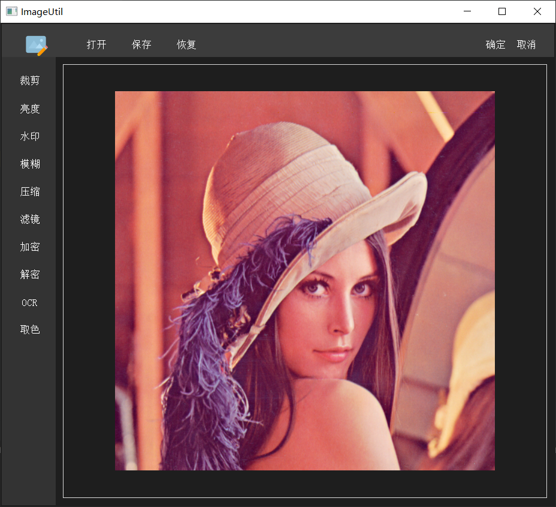

# ImageUtils
本项目是计算机视觉课程上的一个练手项目，是基于 OpenCV 、PyQt 编写的一个可视化的图片处理软件。该软件能够对图片进行一些基本的处理，提供的功能包括：图片裁剪、亮度调整、添加水印、图片模糊、图片压缩、添加滤镜、图片加密、图片解密、OCR、取色。


## 1. 界面设计

软件界面主要分为三个区域，如下图所示。

软件界面的上面部方，分别为软件图标、菜单区；在下面部分中，左侧为功能区，右侧为图片显示区域。当用户在使用部分功能时，软件的右上角区域会出现图中所示的 “确定”  、“取消”  按钮。只有当用户点击 “确定” 按钮后，相应的功能才会真正生效。


## 2. 功能介绍

软件功能的具体介绍如下：

- **图片裁剪**

  用户在打开图片后，点击功能区的 “裁剪” ，然后可以在图片显示区域内，用矩形选出待裁剪的区域，之后点击右上角的 “确定” 即可。

- **亮度调整**

  点击功能区的 “亮度” ，然后会显示一个滑动条。用户滑动滑动条，可以将图片的亮度调亮或调暗，当用户调到满意的亮度后，点击右上角的 “确定” 即可。

- **添加水印**

  点击功能区的 “水印” ，然后会弹出一个对话框。用户可以在对话框内输入水印的文本内容，支持输入中文，同时可从 “左上角、右上角、中间、左下角、右下角” 五个选项中选择水印的位置。之后，点击对话框的 “OK” 按钮，添加水印。最后，点击右上角的 “确定” 即可。

- **图片模糊**

  点击功能区的 “模糊” ，然后可以在图片显示区域内，用矩形选出待模糊的区域，之后点击右上角的 “确定” 即可。

- **图片压缩**

  点击功能区的 “压缩” ，然后会弹出一个对话框。用户在对话框内输入目标图片的宽度、高度，之后点击对话框的 “OK” 按钮即可将图片压缩到指定大小。

- **添加滤镜**

  点击功能区的 “滤镜” ，然后会弹出一个对话框。用户可以在对话框中选择 “黑白、素描、浮雕、怀旧” 四种预设的滤镜效果，选择完滤镜效果后，点击对话框的 “OK” 按钮，添加滤镜效果。最后，点击右上角的 “确定” 按钮后，滤镜效果真正生效。

- **图片加密**

  点击功能区的 “加密” ，然后会弹出一个文件对话框，让用户选择密钥的保存位置。用户选择文件的保存位置后，图片便会被加密，同时在相应的目录下生成一个名为 “img_key” 的密钥文件。

- **图片解密**

  点击功能区的 “解密” ，然后会弹出一个文件对话框，让用户选择密钥文件。如果选择的是正确的密钥文件，则图片会被解密，并且在右侧的图片显示区域中显示。否则，图片不会被解密成功。

- **OCR**

  用户打开待识别文字的图片后，点击功能区的 “OCR” 。待OCR识别完后，软件会弹出一个对话框，在对话框内的文本区域内会显示识别的文字结果。同时，用户可以在文本区域内对识别结果进行格式、内容的调整。用户调整完后，可以选择复制结果。

- **取色**

  点击功能区的 “取色” ，然后会弹出一个对话框，在对话框中会显示当前鼠标所在位置的颜色。用户移动鼠标的位置，对话框中显示的颜色值会发生相应的变化，待用户移到需要取色的位置后，按 “空格” 键即可确定颜色值。最后，用户可以选择复制颜色的RGB值或十六进制值。

- **恢复**

  当用户操作错误后，想要恢复原始的图片，点击软件上方菜单区中的 “恢复” 即可。


## 3. 代码说明

- 核心代码（图片处理代码）

  本项目中所有图片处理相关的代码均在 [**“com/zeketian/imageutil/control/BasicProcessingUtil.py”**](https://github.com/ZekeTian/ImageUtils/blob/master/com/zeketian/imageutil/control/BasicProcessingUtil.py)  文件中。

- 界面代码

  软件的界面是利用 PyQT 的 **Designer** 工具设计，所有 **.ui** 文件均是由该工具生成。之后，再利用 **Pyuic** 工具将 **.ui** 文件转换成 Python 文件。软件主体界面代码在文件 [“com/zeketian/imageutil/ui/MainUI.py”](https://github.com/ZekeTian/ImageUtils/blob/master/com/zeketian/imageutil/ui/MainUI.py) 中。


## 4. 特别说明

- OCR 配置

本项目中的  “OCR”  功能使用了百度的 OCR 识别 API，因此如果需要使用该功能，请先在百度 AI 开放平台中创建OCR 识别项目，然后修改 [**“com/zeketian/imageutil/control/BasicProcessingUtil.py”**](https://github.com/ZekeTian/ImageUtils/blob/master/com/zeketian/imageutil/control/BasicProcessingUtil.py) 的 **img_ocr** 函数中的API 配置信息，如下所示。

```python
APP_ID = '你的 App ID'
API_KEY = '你的 Api Key'
SECRET_KEY = '你的 Secret Key'
```

- 取色功能

  本项目中  “取色”  功能使用了 shuoGG1239 的 [ColorCatcher](https://github.com/shuoGG1239/ColorCatcher) 项目的代码，特别感谢。

- 图片文件路径

  在选择图片时，图片文件所在的路径中不要出现中文，否则打开图片时可能会出现问题。

